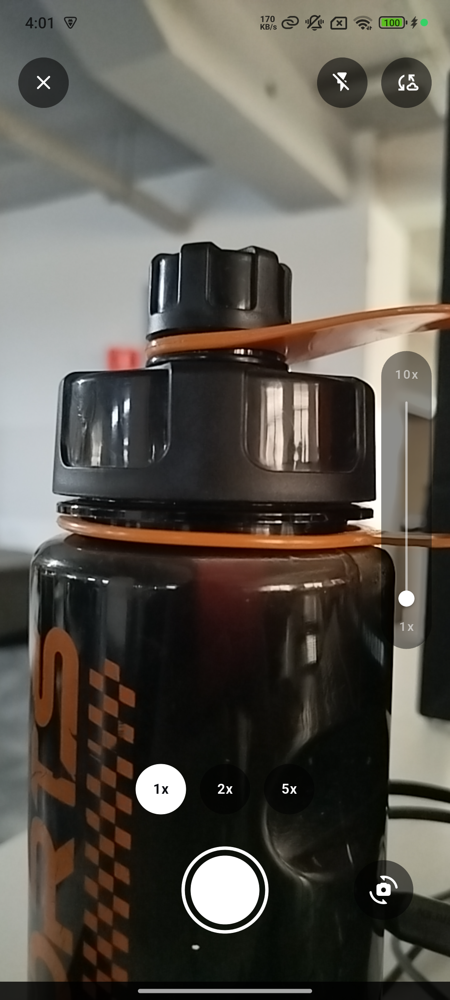
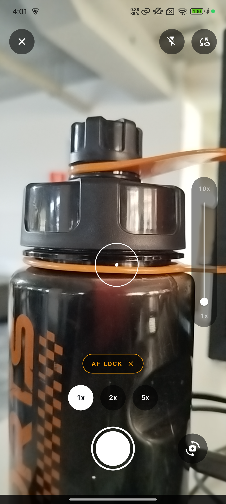
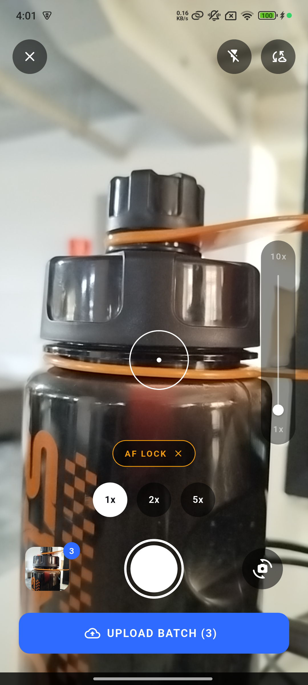
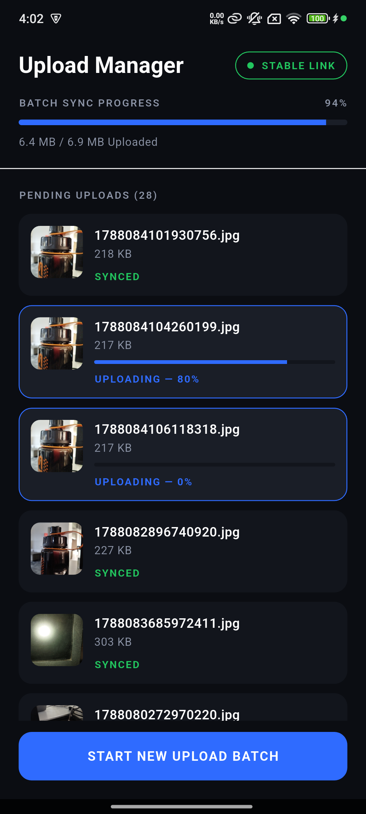
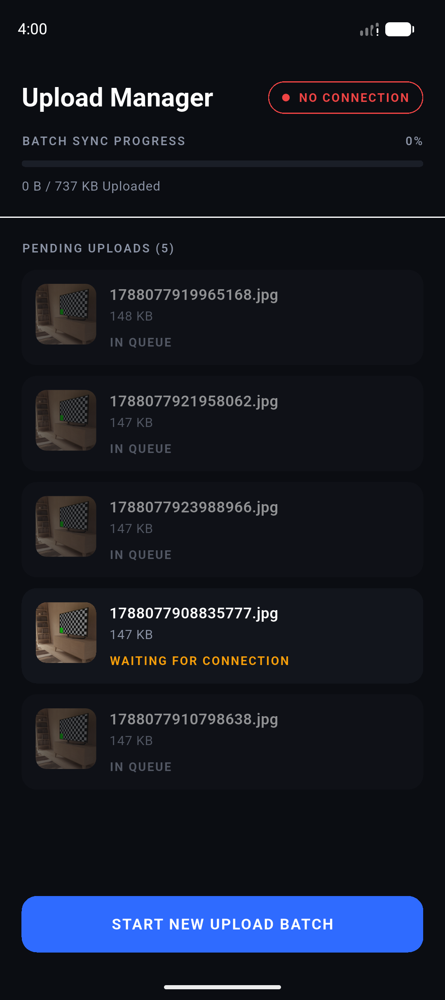
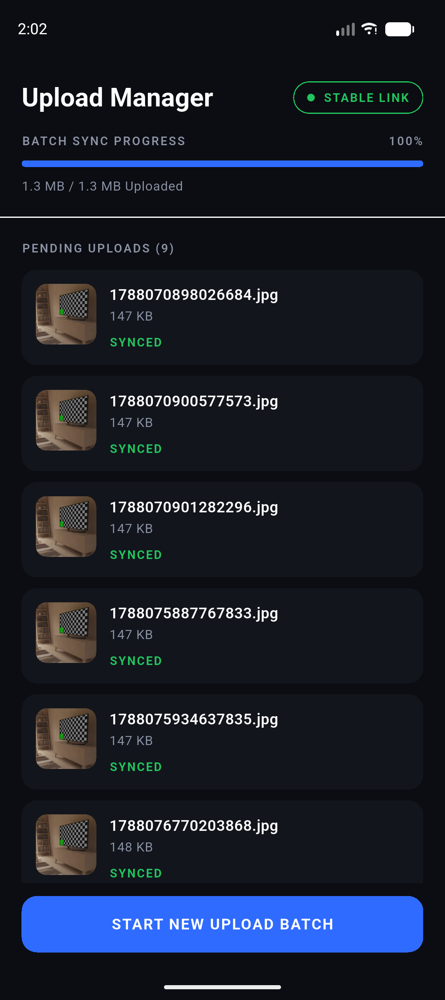

# SnapSync

A batch-capture camera for Android with a sync engine that refuses to lose your photos.
Shoot a batch, hand it to the queue, and it uploads itself — resuming on its own when
the connection comes back, without you opening the app again.

**[Download the release APK](https://drive.google.com/file/d/1Jk2_5wM_S9lO69m6XNMPXzftzbH8vZHX/view?usp=sharing)**

| Camera | Manual focus | Batch ready |
|---|---|---|
|  |  |  |

| Uploading | Offline | Synced |
|---|---|---|
|  |  |  |

---

## Tech stack

| | |
|---|---|
| **Language** | Dart 3.10 (Flutter 3.47.2, stable) |
| **UI** | Material 3, dark theme, custom design system via `ThemeExtension` |
| **Architecture** | Layered `presentation → domain ← data`, BLoC presentation |
| **State** | `flutter_bloc` 9.1.1, `equatable` 2.1.0 |
| **Camera** | `camera` 0.12.0 (CameraX under the hood) |
| **Permissions** | `permission_handler` 13.0.1 |
| **Persistence** | `drift` 2.28.2 + `drift_flutter` — typed SQL with reactive queries |
| **Background work** | `workmanager` 0.10.9, `connectivity_plus` 7.3.1 |
| **Networking** | `dio` 5.9.0, with a mock client standing in for the absent API |
| **Files** | `path_provider` 2.1.5 |
| **DI** | `get_it` 9.2.1 |
| **Build** | AGP with `compileSdk` 37, NDK 27.0.12077973, JVM target 17 |

---

## What it does

**Camera**

- **Pinch to zoom**, a vertical zoom rail, and rounded zoom stops (`1x`, `2x`, `5x`).
- **Lens buttons** appear for every back camera the device exposes; devices reporting a
  single back camera show zoom stops only.
- **Tap to focus** pins focus and exposure to the tapped point and holds them there,
  with a ring at the tap point and an `AF LOCK` chip to release back to auto.
- **Flip** between back and front, re-reading the zoom range for the new lens.

**Batches and sync**

- Every shot is written to app storage and enqueued as a row in the local database.
- `UPLOAD BATCH (n)` closes the open batch and hands it to the sync engine; capture
  continues into a fresh batch immediately.
- The Upload Manager lists every queued file with its live state — `WAITING FOR
  CONNECTION`, `IN QUEUE`, `UPLOADING — 65%`, `RETRYING… ATTEMPT 3/5`, `SYNCED` —
  grouped newest batch first.

It is built so that a failed upload is never a lost photo:

- **Photos leave the cache immediately.** `takePicture()` writes to a directory Android
  may purge; every capture is moved to app documents before it is queued.
- **The database is the only source of truth.** The background worker runs in a separate
  isolate and cannot see a BLoC, so state lives in SQL and the UI observes it.
- **Nothing is attempted offline.** The runner checks connectivity before each file and
  stops rather than burning a retry, so the queue is preserved by doing nothing.

---

## Project structure

```
presentation → domain ← data
```

Domain never imports data. The layering is expressed as directories, mirroring the
package structure used in the Android half of this assessment.

```
lib/
├── core/
│   ├── domain/        Result · AppError hierarchy · UploadState
│   ├── data/
│   │   ├── database/  Drift schema · UploadQueueDao
│   │   ├── network/   UploadClient · MockUploadClient · DioUploadClient
│   │   └── sync/      UploadScheduler · ConnectivityObserver
│   ├── designsystem/  theme/ (palette → M3 → status tokens) · components/
│   └── ui/            EffectEmitter · EffectListener · ErrorToText · ByteFormat
├── feature/
│   ├── camera/        data/ (CameraDataSource · CaptureStorage) · presentation/
│   └── upload/        data/ (UploadRunner) · presentation/
└── app/               entry point · DI · background isolate
```

### Approach

**BLoC with one state object per screen.** Each screen has a single state class and one
mutation point — `bloc.add(event)`. One-shot outcomes (opening app settings, navigating
to the Upload Manager, snackbars) travel as effects through a separate stream via the
`EffectEmitter` mixin, never as state, because BLoC drops equal states and an effect
must fire every time.

**Reactive queries, not manual refresh.** The camera badge and the Upload Manager both
subscribe to Drift queries. Closing a batch is a single `UPDATE` to one settings row;
both screens re-render because the query declares `readsFrom` on the tables it touches.

```dart
Stream<List<UploadItem>> watchSubmitted() => _watch(
  'SELECT * FROM upload_items '
  'WHERE batch_id < (SELECT current_batch_id FROM queue_settings WHERE id = 0) '
  'ORDER BY batch_id DESC, id ASC',
);
```

**A batch needs no "closed" column.** The open batch is by definition the highest id, so
`batch_id < current_batch_id` means "handed to the sync engine". There is no flag to keep
in sync and no half-closed state after a crash.

**The screen holds no logic.** Every state-dependent string and colour is resolved in the
BLoC — `UPLOAD BATCH (3)`, `RETRYING… ATTEMPT 3/5`, the tone each row renders in — so
widgets read `row.statusLabel` rather than deciding anything.

### Main classes

| Class | Responsibility |
|---|---|
| `CameraBloc` | Owns `CameraState`; camera lifecycle, zoom, focus lock, lens choice, capture |
| `UploadManagerBloc` | Projects queue rows into labels, tones and batch progress; tracks connectivity |
| `CameraDataSource` | Wraps the camera plugin; permissions and hardware faults become typed errors |
| `UploadQueueDao` | The queue as typed SQL — enqueue, close batch, next eligible, state transitions |
| `UploadRunner` | Drains the queue serially: progress, failure, `attempts++`, backoff, retry |
| `AppError` | Sealed hierarchy (`CameraError`, `NetworkError`, `ApiError`) — every case must map to a message or the build fails |

---

## The mocked API

No API was provided, so uploads run through a **`MockUploadClient` behind an
`UploadClient` interface**. A mock that returns instant success would prove nothing, so
this one simulates: it streams progress in ten steps, fails roughly a third of uploads
part-way through with `noInternet` or `timeout`, and succeeds on a later attempt.

`DioUploadClient` sits beside it — a real `MultipartFile` upload using `onSendProgress`,
with `DioException` mapped onto the same error types. Swapping the two is one line:

```dart
..registerLazySingleton<UploadClient>(MockUploadClient.new)   // → DioUploadClient(...)
```

**Retry policy.** A row is eligible while `state IN (pending, failed) AND attempts < 5`,
so a failure re-qualifies automatically. After five attempts it stops and reads
`UPLOAD FAILED` rather than pretending it is still trying.

**Scheduling is a constraint, not a poll.** The worker is a one-off task carrying
`NetworkType.connected`, so Android holds it until a network exists and then runs it.
A periodic task was rejected: the platform minimum is 15 minutes, which would make
"retry once a stable connection is detected" untrue by up to a quarter of an hour.

---

## How to run

Prefer not to build it? [Download the release APK](https://drive.google.com/file/d/1Jk2_5wM_S9lO69m6XNMPXzftzbH8vZHX/view?usp=sharing).

```sh
git clone https://github.com/Saklayen/snap-sync.git
cd snap-sync
flutter pub get
dart run build_runner build --delete-conflicting-outputs   # Drift code generation
flutter run
```

Requires the Flutter SDK (3.47+), and an Android device or emulator. The camera needs a
physical device to be worth looking at — zoom range and lens count come from the
hardware, and an emulator reports neither.

**Seeing the sync engine work:**

```sh
adb shell svc wifi disable && adb shell svc data disable   # queue holds, nothing uploads
adb shell svc wifi enable  && adb shell svc data enable    # uploads resume on their own
```

```sh
flutter analyze
flutter build apk --release
```

---

## Generative AI usage

This project was built with **Claude Code** (Claude Opus), context engineering first and
code second. Before any feature work I prepared the documents the model would build
from: the product concept, a BRD with every ambiguity in the brief resolved, a technical
specification, the architecture, the code convention, the design system guideline, and a
work breakdown. With those fixed, the model had a specification to satisfy rather than a
blank page, and its output stayed consistent across a dozen commits.

**Sample prompts**

> Batch sync progress is `sum(bytesSent) / sum(totalBytes)` over the submitted rows.
> Handle the zero-size case, and resolve both the percentage and the "6.4 MB / 6.9 MB
> Uploaded" label in the BLoC — the widget must not compute anything.

> This camera `Stack` is nested five levels deep. Extract the overlay chrome into named
> widgets that each take explicit fields; no sub-widget receives the whole state object.

Every architectural decision stayed mine, nothing was committed without me reading the
diff, and behaviour was verified on a physical device rather than inferred from the code.
